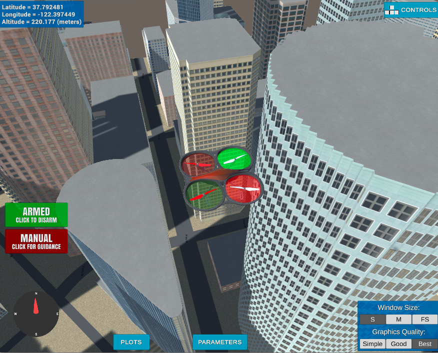

## Flying Car Nanodegree Program - Project 2: 3D Motion Planning


---

### Explain the Starter Code

#### 1. Explain the functionality of what's provided in `motion_planning.py` and `planning_utils.py`
These scripts contain a basic planning implementation that includes...

With simulator started up, when running out of the box with the command line 
 
```sh
source activate fcnd
python motion_planning.py
```

The quad fly a jerky path of waypoints to the northeast. It is becuase in the `planning_utils.py`, the grid path planning algorithm only implemented 4 possible actions, north, west, east, south. When asked to plan a goal position that is at a diagonal north east location, 
the planner has no choice, but to give a solution to follow a jerky north, east, north, east, ... , north, east action path.

The other difference about `motion_planning.py` from the `backyard_flyer_solution.py` script inlcudes:
1. There is a new PLANNING state added, which is excuted after ARMING state and before TAKEOFF state.
2. After the ARMING state, a new function `plan_path()` is invoked, it does the following things:
  * set the state to `States.PLANNING`, 
  * load the 2.5D map in the colliders.csv file describing the environment and obstacle,
  * discretize the environment into a grid representation,
  * define the start and goal locations,
  * perform a search using A* search algorithm,
  * convert returned path to waypoints

Most functions called by `plan_path()` is provided in `planning_utils.py`.
  * create_grid() is the function to digitize the 2.5D map enviroment of free space and obstacle space into a grid representation of a 2D configuration space at given altitude and safety distance.
  * Action() defines possible actions represented by a 3 element tuple. The first 2 values are the delta of the action relative to the current grid position. The third one is the cost of performing the action. The default implementation only has 4 possition actions to the north, east, south, west. If diagonal action is necessary, more actions need to be added to the list. 
  * valid_actions() checks neighbor to make sure returned list of possible actions will not lead off the grid or bump into obstacle.
  * a_star() is the path planning search algorithm to do the heavy lifting work. It exlore the 2D configuration space to find an optimal path based on minimizing the sum of two costs, the cost of the path from the start node to n, and a heuristic estimatng the cost of the cheapest path from n to the goal.
  * heuristic() is an estimate of the minimum cost from any point to the goal. Manhattan distance or euclidean distance can be used as heuristic for a grid. In the starter code, the euclidean distance is implemented.


### Implementing Path Planning Algorithm

#### 1. Set global home position
In my code, I read the first line of the csv file, extract lat0 and lon0 with the help of `split()` and `strip()` functions, then covert from string to floating point values. Lastly use the self.set_home_position() method to set global home. 

```
# Read lat0, lon0 from colliders into floating point values
with open('colliders.csv') as f:
    first_line = f.readline()
    lat0 = float(first_line.split(',')[0].strip().split(' ')[1])
    lon0 = float(first_line.split(',')[1].strip().split(' ')[1])

# Set home position to (lon0, lat0, 0)
self.set_home_position(lon0, lat0, 0.0)
```

#### 2. Set your current local position
In the code, I retrieve current global position from `self._longitude, self._latitude, self._altitude`, then convert them to local position with `global_to_local()` function. Make sure the order of the parameters, global position is (lon, lat, up), local position is (north, east, down).

But I found these lines of code are not necessary. Once global home position is set by `set_home_position()`. Local position is automatically been set. No need to call these function here, so I commented these lines out.

```
# Retrieve current global position
# global_position = (self._longitude, self._latitude, self._altitude)

# Convert current global position (lon, lat, up) to a local position (north, east, down)
# local_position = global_to_local(global_position, self.global_home)
```

#### 3. Set grid start position from local position

To find the start postion on the grid, subtract the lower left corner local position of the map from the current start local position. The original (0,0) shifted from the center of the map to the lower left corner (plus some safety margin).

'''
grid_start = (int(self.local_position[0])-north_offset, 
              int(self.local_position[1])-east_offset)
'''

#### 4. Set grid goal position from geodetic coords

First use global_to_local() to convert from goal global postion to goal local postion. Then again subtract north_offset and east_offset from coresponding coordinates to find the goal postion on the grid.

```
# Adapt to set goal as latitude / longitude position and convert
goal_global = (-122.4007, 37.7954, 28.0)
goal_local  = global_to_local(goal_global, self.global_home)
grid_goal = (int(goal_local[0])-north_offset, 
             int(goal_local[1])-east_offset)
```

#### 5. Modify A* to include diagonal motion
The code in planning_utils() is modified the A* implementation to include diagonal motions on the grid that have a cost of sqrt(2).

Add the following diagnal motion to the `Action()` class:
```
NORTH_WEST = (-1, -1, np.sqrt(2))
NORTH_EAST = (-1, 1, np.sqrt(2))
SOUTH_WEST = (1, -1, np.sqrt(2))
SOUTH_EAST = (1, 1, np.sqrt(2))
```

and the following checks to the `valid_actions()` method:
```
# check if the node is off the grid or it's an obstacle

if x - 1 < 0 or grid[x - 1, y] == 1:
    valid_actions.remove(Action.NORTH)
if x + 1 > m or grid[x + 1, y] == 1:
    valid_actions.remove(Action.SOUTH)
if y - 1 < 0 or grid[x, y - 1] == 1:
    valid_actions.remove(Action.WEST)
if y + 1 > n or grid[x, y + 1] == 1:
    valid_actions.remove(Action.EAST)

if x - 1 < 0 or y - 1 < 0 or grid[x - 1, y - 1] == 1:
    valid_actions.remove(Action.NORTH_WEST)
if x - 1 < 0 or y + 1 > n or grid[x - 1, y + 1] == 1:
    valid_actions.remove(Action.NORTH_EAST)
if x + 1 > m or y - 1 < 0 or grid[x + 1, y - 1] == 1:
    valid_actions.remove(Action.SOUTH_WEST)
if x + 1 > m or y + 1 > n or grid[x + 1, y + 1] == 1:
    valid_actions.remove(Action.SOUTH_EAST)1] == 1:
```    

#### 6. Cull waypoints 

Collinearity test is used to check whether waypoints are on the (almost) same stargith line. Then simply to prune the path of unnecessary waypoints that are in the middle of the same straight lines. 


```
def collinearity_check(p1, p2, p3, epsilon=1e-6):   
    m = np.concatenate((p1, p2, p3), 0)
    det = np.linalg.det(m)
    return abs(det) < epsilon

def prune_path(path):
    # pruned_path = [p for p in path]
    pruned_path = path
    
    i = 0
    while i < len(pruned_path) - 2:
        p1 = point(pruned_path[i])
        p2 = point(pruned_path[i+1])
        p3 = point(pruned_path[i+2])
        
        # If the 3 points are in a line remove
        # the 2nd point.
        # The 3rd point now becomes and 2nd point
        # and the check is redone with a new third point
        # on the next iteration.
        if collinearity_check(p1, p2, p3):
            # Something subtle here but we can mutate
            # `pruned_path` freely because the length
            # of the list is check on every iteration.
            pruned_path.remove(pruned_path[i+1])
        else:
            i += 1
    return pruned_path
```

### Execute the flight
#### 1. Does it work?  It works!

### Try flying more complex trajectories
In this project, things are set up nicely to fly right-angled trajectories, where you ascend to a particular altitude, fly a path at that fixed altitude, then land vertically. However, you have the capability to send 3D waypoints and in principle you could fly any trajectory you like. Rather than simply setting a target altitude, try sending altitude with each waypoint and set your goal location on top of a building!

### Adjust your deadbands
Adjust the size of the deadbands around your waypoints, and even try making deadbands a function of velocity. To do this, you can simply modify the logic in the `local_position_callback()` function.

### Add heading commands to your waypoints
In the default setup, you're sending waypoints made up of NED position and heading with heading set to 0 in the default setup. Try passing a unique heading with each waypoint. If, for example, you want to send a heading to point to the next waypoint, it might look like this:

```python
# Define two waypoints with heading = 0 for both
wp1 = [n1, e1, a1, 0]
wp2 = [n2, e2, a2, 0]
# Set heading of wp2 based on relative position to wp1
wp2[3] = np.arctan2((wp2[1]-wp1[1]), (wp2[0]-wp1[0]))

```


Here's | A | Snappy | Table
--- | --- | --- | ---
1 | `highlight` | **bold** | 7.41
2 | a | b | c
3 | *italic* | text | 403
4 | 2 | 3 | abcd

And here's a lovely image of my results (ok this image has nothing to do with it, but it's a nice example of how to include images in your writeup!)


And here is a lovely picture of our downtown San Francisco environment from above!


Meanwhile, here's a picture of me flying through the trees!


